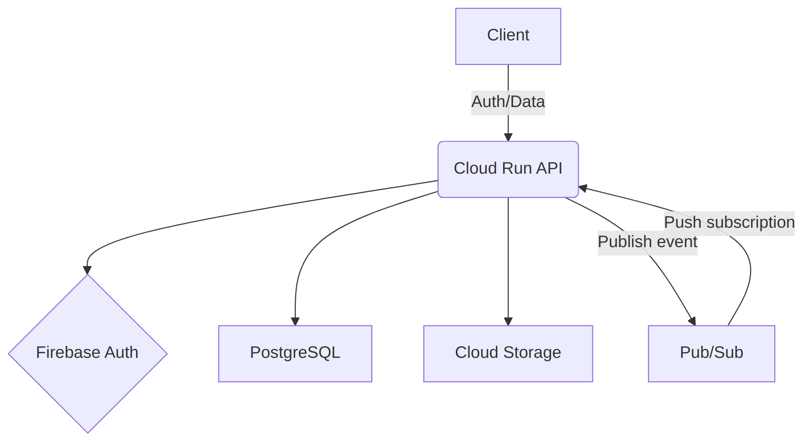

# Architecture

## System Overview

| Layer | Technology | Where |
|---|---|---|
| Frontend | Vue 3 + Vite + PrimeVue | `source/web-frontend/` |
| API | .NET 10 Web API on GCP Cloud Run | `source/web-api/` |
| Database | PostgreSQL on Neon (prod) / Docker (dev) | port 5432 |
| Events | GCP Pub/Sub | emulator on port 8085 |
| File storage | GCP Cloud Storage | emulator on port 4443 |

## High-Level Flow



---

## Backend (`source/web-api/`)

### Vertical Slice Architecture

Features are self-contained under `Features/DomainArea/FeatureName/` — each slice has its own controller and repository. There is no shared service layer.

```
Features/
  Documents/
    CreateDocument/   ← CreateDocumentController.cs + CreateDocumentRepository.cs
    UploadDocument/
    SaveDocument/
    ...
  Notes/
  Projects/
  ...
```

Key entry points:
- `Program.cs` — DI registration, auth middleware, CORS, GCS client, Pub/Sub publisher
- `Features/AuthenticatedBaseController.cs` — base class for all auth-required endpoints; carries `[Authorize]` + `[ApiController]` and exposes `GetFirebaseUid()`
- `Features/Ping/PingController.cs` — `GET /api/ping` health check

### Authentication

Firebase JWT Bearer is configured in `Program.cs` for `securetoken.google.com/{projectId}` with `MapInboundClaims = false` so claim names are preserved as-is (e.g. `sub` rather than the Microsoft URI equivalent).

All endpoints requiring auth inherit `AuthenticatedBaseController` and call `GetFirebaseUid()` to read the `sub` claim.

Pub/Sub push endpoints use a separate `PubSub` JWT Bearer scheme validated against `accounts.google.com`.

### Data Access

All database access uses **Dapper** via a thin `IDbContext` abstraction in `Apotheca.Data`.

| Type | Role |
|---|---|
| `IDbContextFactory` | Singleton. Inject into features to obtain a context. |
| `IDbContext` | Opened connection + optional transaction. Dispose after use. |
| `DbContextFactory` | Reads `ConnectionStrings:Postgres` from config; uses `NpgsqlDataSourceBuilder` (enforces UTC for all `TIMESTAMPTZ`). |

**Read query:**
```csharp
await using var db = await _dbContextFactory.CreateAsync(cancellationToken);
var rows = await db.QueryAsync<MyModel>("SELECT * FROM my_table WHERE id = @Id", new { Id = id });
```

**Write with transaction:**
```csharp
await using var db = await _dbContextFactory.CreateAsync(cancellationToken);
await db.BeginTransactionAsync(cancellationToken);
await db.ExecuteAsync("INSERT ...", param);
await db.CommitAsync(cancellationToken);
```

Methods on `IDbContext` are ordered alphabetically — follow this when adding new ones.

### File Storage (GCS)

`StorageClient` is registered as a singleton in `Program.cs`. When `Storage:EmulatorHost` is configured it uses `StorageClientBuilder` with `UnauthenticatedAccess = true`; otherwise it uses the application default credential.

Object naming conventions (all under the single `apotheca` bucket):

| Type | GCS path |
|---|---|
| Document file | `projects/{projectId}/documents/{documentId}/{filename}` |
| Note attachment | `projects/{projectId}/notes/{noteId}/{attachmentId}{ext}` |

The `/` separator creates a virtual folder hierarchy. The `blob_reference` column on `documents` and `note_attachments` tables stores the full object path.

### Logging

The API uses `Google.Cloud.Logging.Console` for structured JSON logs to stdout. In non-development environments the default ASP.NET Core providers are cleared and replaced with the Google Cloud console formatter; Cloud Run's log router forwards stdout to Cloud Logging automatically.

**Adding a log statement:**
```csharp
public class MyController(ILogger<MyController> logger) : AuthenticatedBaseController
{
    logger.LogInformation("Something happened. Id: {Id}, UserId: {UserId}", id, userId);
}
```

Use named placeholders — they are captured as structured fields in Cloud Logging and are individually queryable.

**Viewing logs in Cloud Logging:**
```
resource.type="cloud_run_revision"
resource.labels.service_name="apotheca-api"
severity="INFO"
```

---

## Frontend (`source/web-frontend/`)

Vue 3 + Vite + PrimeVue (Aura preset). Dark theme activated via `.app-dark` on the root element; brand colors are CSS custom properties in `src/assets/main.css`.

### Layouts

- `PublicLayout.vue` — nav bar for unauthenticated pages (Home, Features, About, Login)
- `AppLayout.vue` — nav bar for authenticated pages; includes Dashboard/Notes/Tasks tabs, project jump dropdown, and Logout

### Router (`src/router/index.js`)

- `/` → redirects to `/home`
- **Public** (PublicLayout): `/home`, `/features`, `/about`, `/auth/login`, `/logging-in`
- **Authenticated** (AppLayout, `requiresAuth: true`): `/dashboard`, `/notes`, `/tasks`, `/project/:id`

Post-login redirect goes to `/dashboard`.

### Key Views

| View | Path | Purpose |
|---|---|---|
| `DashboardView.vue` | `/dashboard` | Stat cards and activity overview |
| `NotesView.vue` | `/notes` | Folder sidebar + notes card grid |
| `TasksView.vue` | `/tasks` | Filter sidebar + task list |
| `ProjectView.vue` | `/project/:id` | Per-project page; sections for Notes, Tasks, Activity, Members |
| `DocumentsView.vue` | `/project/:id/documents` | Folder hierarchy + document grid with drag-drop upload |

### Composables

| Composable | Purpose |
|---|---|
| `useAuth.js` | Firebase auth singleton; Google, Microsoft, email/password providers |
| `useProjects.js` | Fetches the user's project list from the API |
| `useDocumentFolders.js` | Document CRUD and file upload |

### Authentication

Firebase Authentication handles all auth. The client is initialised in `src/firebase.js`; all auth logic is in `useAuth.js`.

Auth state is tracked via `onAuthStateChanged` as a module-level singleton, shared across all `useAuth()` callers. Firebase error codes are mapped to friendly messages in `EMAIL_ERRORS`. Errors surface via PrimeVue Toast.

Supported providers:
- **Google** — `GoogleAuthProvider`
- **Microsoft** — `OAuthProvider('microsoft.com')`
- **Email/Password** — `signInWithEmailAndPassword` / `createUserWithEmailAndPassword` / `sendPasswordResetEmail`

### Color Palette

| Role | Hex | CSS variable |
|---|---|---|
| Background (primary) | `#0a0a0f` | `--bg-primary` |
| Background (nav/sidebar) | `#0d0d14` | `--bg-nav` |
| Background (card) | `#111118` | `--bg-card` |
| Brand purple | `#a855f7` | `--color-purple` |
| Brand purple (light) | `#c084fc` | `--color-purple-light` |
| Brand pink | `#ec4899` | `--color-pink` |
| Brand pink (light) | `#f472b6` | `--color-pink-light` |
| Text (primary) | `#f1f0f5` | `--text-primary` |
| Text (secondary) | `#b8b4c8` | `--text-secondary` |
| Text (muted) | `#7a7590` | `--text-muted` |
| Text (dim) | `#524e65` | `--text-dim` |
| Brand gradient | `#a855f7` → `#ec4899` (135°) | `--gradient-brand` |

---

## Database Migrations

Migrations are managed by **DbUp** in `Apotheca.Migrations`. Scripts run every time (no journal) so all scripts must be idempotent — use `CREATE TABLE IF NOT EXISTS`, `CREATE OR REPLACE FUNCTION`, etc.

### Script folders

Scripts live under `Apotheca.Migrations/Scripts/` in subfolders that run in this fixed order:

| Folder | Purpose |
|---|---|
| `Schemas/` | `CREATE SCHEMA` statements |
| `Tables/` | `CREATE TABLE`, indexes, constraints |
| `Functions/` | Stored functions and triggers |

Within each folder, scripts run alphabetically. Use `NNNN_description.sql` naming to control order. To add a new folder, create the subfolder and add it to the `scriptFolders` array in `Apotheca.Migrations/Program.cs`.

### Adding a migration

1. Add a `.sql` file to the appropriate subfolder.
2. Scripts are embedded resources — no registration needed.
3. Each script runs in its own transaction; failure leaves the database unchanged and exits with code 1.

### Running migrations locally

```bash
dotnet run --project source/web-api/Apotheca.Migrations -- "Host=localhost;Port=5432;Database=apotheca;Username=apotheca;Password=apotheca"
```

---

## Deployment

Deployments run via `deployment/deploy.ps1`. The script prompts for each phase so steps can be skipped.

### Prerequisites (one-time)

**Google Cloud SDK** — for API deployment:
```powershell
winget install -e --id Google.CloudSDK
gcloud auth login
```

**Firebase CLI** — for frontend deployment:
```powershell
npm install -g firebase-tools
firebase login
```

Copy `secrets/deploy_secrets.template.json` to `secrets/deploy_secrets.json` (gitignored) and fill in all values before the first run.

### Deployment phases

| Phase | What it does |
|---|---|
| Migrations | Runs `Apotheca.Migrations` against Neon via `ConnectionString` env var |
| API | Cloud Build compiles and pushes a Docker image to Artifact Registry, deploys to Cloud Run |
| Frontend | Writes `.env.production` from secrets, runs `npm run build`, deploys to Firebase Hosting, deletes `.env.production` |

### Post-deployment checklist (one-time per new domain)

When the frontend URL changes:
- `secrets/deploy_secrets.json` → `FrontendUrl` — controls the API's CORS allowed origin
- Firebase Console → Authentication → Settings → Authorized domains → add the new domain
- Azure Portal → App registrations → your app → Authentication → Redirect URIs → add `https://<domain>/__/auth/handler`

### Production URLs

| Resource | URL |
|---|---|
| API | `https://apotheca-api-fmoznjmzma-nw.a.run.app` |
| API health check | `https://apotheca-api-fmoznjmzma-nw.a.run.app/ping` |
| Frontend | `https://apotheca-490805.web.app` |
| Firebase project | `apotheca-490805` |

---

## Local Development

### Services

Start everything with `docker compose up -d`.

| Service | URL / connection |
|---|---|
| PostgreSQL | `Host=localhost;Port=5432;Database=apotheca;Username=apotheca;Password=apotheca` |
| pgAdmin | http://localhost:5050 |
| Pub/Sub emulator | http://localhost:8085 |
| GCS emulator | http://localhost:4443 |
| API | https://localhost:6060 |
| Frontend | http://localhost:5173 |

### Using pgAdmin

1. Open http://localhost:5050 and log in: `admin@apotheca.dev` / `apotheca`
2. Right-click **Servers → Register → Server**
3. **General** tab — Name: `apotheca` (or anything)
4. **Connection** tab:
   - Host: `apotheca-postgres`
   - Port: `5432`
   - Database: `apotheca`
   - Username / Password: `apotheca`
5. Click **Save**

### Browsing the GCS emulator

`fake-gcs-server` has no UI. Use the JSON API or the `gsutil` CLI.

**Browser:**

| What | URL |
|---|---|
| List buckets | http://localhost:4443/storage/v1/b?project=apotheca |
| List objects | http://localhost:4443/storage/v1/b/apotheca/o |
| Download object | `http://localhost:4443/storage/v1/b/apotheca/o/<object-name>?alt=media` (URL-encode `/` as `%2F`) |

**gsutil CLI:**
```bash
STORAGE_EMULATOR_HOST=http://localhost:4443 gsutil ls gs://apotheca/
STORAGE_EMULATOR_HOST=http://localhost:4443 gsutil ls gs://apotheca/<projectId>/
STORAGE_EMULATOR_HOST=http://localhost:4443 gsutil cp gs://apotheca/<objectName> ./local-copy
```
