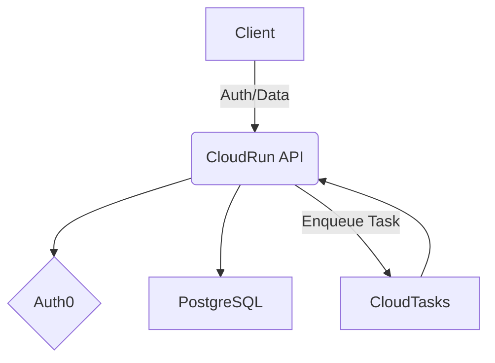

# System Architecture

## Component Overview

- **Frontend**: Vue.js (App Router) - Handles UI and client-side state.
- **API**: .NET 10 on GCP CloudRun - Backend logic for the core application.
- **PostgreSQL**: Database running on Neon (or via Docker in development).
- **Workers**: GCP Cloud Tasks

## High-Level Flow (Mermaid)

