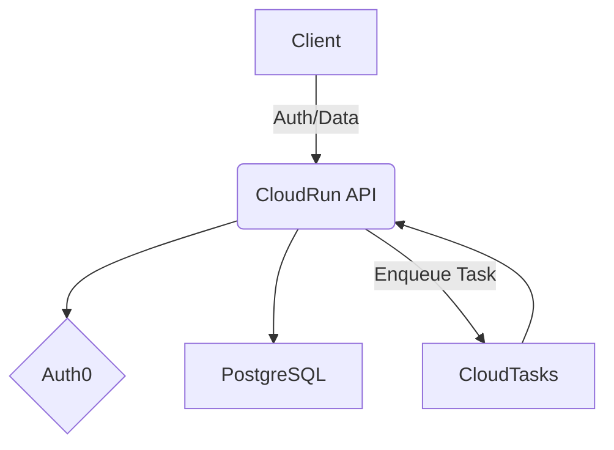

# System Architecture

## Component Overview

- **Frontend**: Vue.js (App Router) - Handles UI and client-side state.
- **API**: .NET 10 on GCP CloudRun - Backend logic for the core application.
- **PostgreSQL**: Database running on Neon (production) or Docker in development (`docker compose up -d`, port 5432).
- **Workers**: GCP Cloud Tasks

## High-Level Flow (Mermaid)



## Data Access

All database access uses **Dapper** via a thin `IDbContext` abstraction in `Apotheca.Data`.

| Type | Role |
|---|---|
| `IDbContextFactory` | Singleton. Inject this into features to obtain a context. |
| `IDbContext` | Opened connection + optional transaction. Dispose after use. |
| `DbContextFactory` | Reads `ConnectionStrings:Postgres` from config, opens an `NpgsqlConnection`, returns an `IDbContext`. |
| `DbContext` | Npgsql implementation. Wraps the connection and transaction; exposes Dapper query methods directly. |

**Pattern — read query:**
```csharp
await using var db = await _dbContextFactory.CreateAsync(cancellationToken);
var rows = await db.QueryAsync<MyModel>("SELECT * FROM my_table WHERE id = @Id", new { Id = id });
```

**Pattern — write with transaction:**
```csharp
await using var db = await _dbContextFactory.CreateAsync(cancellationToken);
await db.BeginTransactionAsync(cancellationToken);
await db.QueryAsync<...>("INSERT ...", param);
await db.CommitAsync(cancellationToken);
```

Methods on `IDbContext` are ordered alphabetically. Follow this convention when adding new query methods.

## Database Migrations

Migrations are managed by **DbUp** in the `Apotheca.Migrations` console project. Scripts run every time (no journal), so all scripts must be idempotent (use `CREATE TABLE IF NOT EXISTS`, `CREATE OR REPLACE FUNCTION`, etc.).

### Script folders

Scripts live under `Apotheca.Migrations/Scripts/` and are organised into subfolders that run in this fixed order:

| Folder | Purpose |
|---|---|
| `Schemas/` | `CREATE SCHEMA` statements |
| `Tables/` | `CREATE TABLE`, indexes, constraints |
| `Functions/` | Stored functions and triggers |

Within each folder, scripts run alphabetically by filename. Use the `NNNN_description.sql` naming convention to control order within a folder.

To add a new folder (e.g. `Seeds/`), create the subfolder and add its name to the `scriptFolders` array in `Program.cs`.

### Adding a migration

1. Add a `.sql` file to the appropriate subfolder under `Apotheca.Migrations/Scripts/`.
2. Scripts are embedded resources — no additional registration needed.
3. Each script runs in its own transaction. A failed script leaves the database unchanged and exits with code 1.

### Running migrations locally

```bash
dotnet run --project source/web-api/Apotheca.Migrations -- "Host=localhost;Port=5432;Database=apotheca;Username=apotheca;Password=apotheca"
```

Or set the environment variable instead of passing the argument:

```bash
export ConnectionStrings__Postgres="Host=localhost;..."
dotnet run --project source/web-api/Apotheca.Migrations
```

### Deployment (Cloud Run)

Run `Apotheca.Migrations` as a **Cloud Run Job** before deploying the API service. The job reads the connection string from the `ConnectionStrings__Postgres` environment variable, applies any pending migrations, and exits. Gate the API deployment on a successful job exit in your CI pipeline.

## Local Development

| Service    | How to run                  | Connection                                                                    |
|------------|-----------------------------|-------------------------------------------------------------------------------|
| PostgreSQL | `docker compose up -d`      | `Host=localhost;Port=5432;Database=apotheca;Username=apotheca;Password=apotheca` |
| pgAdmin    | `docker compose up -d`      | http://localhost:5050 — login: `admin@apotheca.dev` / `apotheca`. Use `apotheca-postgres` as the host when adding a server. |
| API        | `dotnet run` in `source/web-api/` | https://localhost:6060                                                   |
| Frontend   | `npm run dev` in `source/web-frontend/` | http://localhost:5173                                              |

