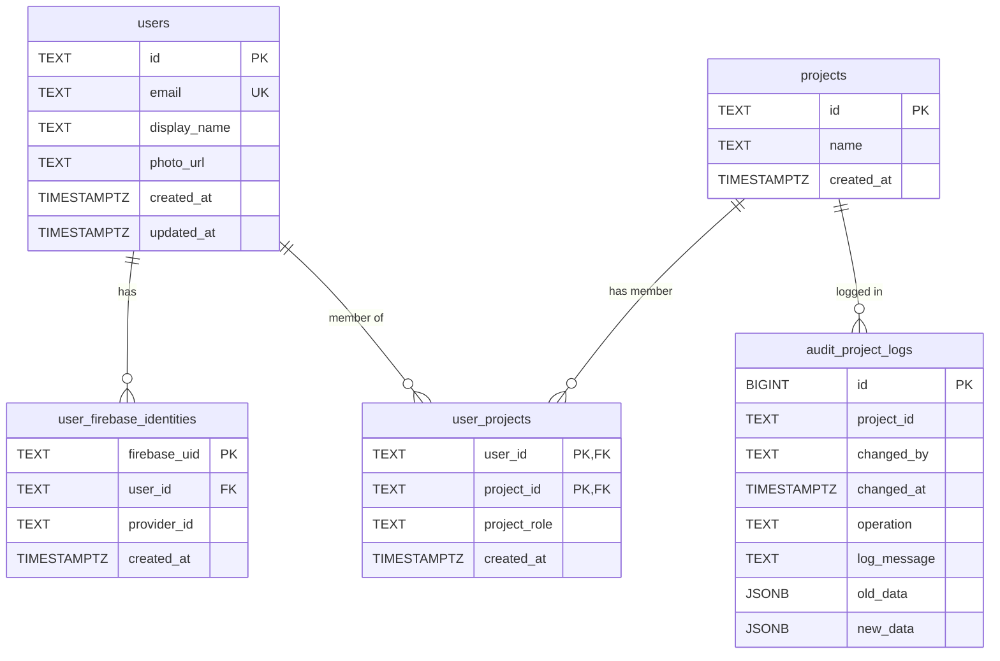

# Data Model

## Core Entities

| Entity | Storage | Description |
| :--- | :--- | :--- |
| **User** | Postgres | Identity, roles, and preferences. |
| **Task** | Postgres | Tasks associated with the current user and/or project. |
| **Project** | Postgres | A collection of tasks, notes, and work items. |

## Relationships
- **User (N) -> Project (N)**: Projects can be shared by many users.
- **User (1) -> Task (N)**: One user can own many tasks.
- **Project (1) -> Task (N)**: Tasks can be associated with a project.

## Entity Relationship Diagram

