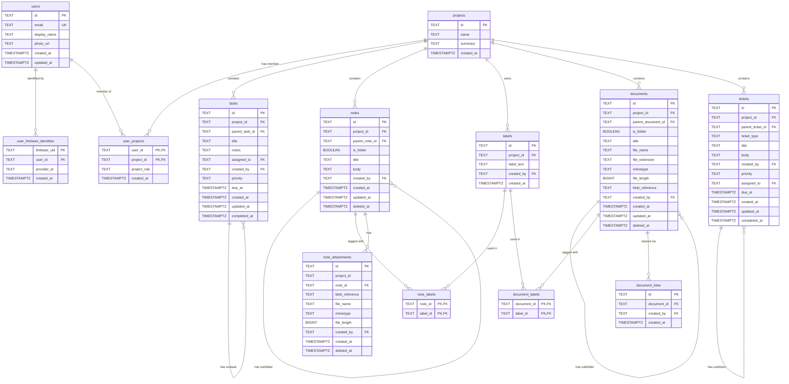

# Data Model

## Schemas

| Schema | Purpose |
|---|---|
| `public` | Core application tables |
| `audit` | Append-only event and audit logs |

---

## Entity Summary

| Entity | Table | Description |
|---|---|---|
| User | `users` | Application user identity and profile |
| Firebase Identity | `user_firebase_identities` | Firebase UIDs linked to a user (one per provider) |
| Project | `projects` | Top-level workspace containing notes, documents, tasks, and tickets |
| User–Project | `user_projects` | Project membership and role for each user |
| Task | `tasks` | To-do items scoped to a project, optionally nested |
| Note | `notes` | Rich-text notes and note folders within a project |
| Label | `labels` | Project-scoped tags applied to notes and documents |
| Note Label | `note_labels` | Many-to-many join between notes and labels |
| Ticket | `tickets` | Issue-tracker items (bugs, features, tasks) within a project |
| Document | `documents` | Uploaded files and document folders within a project |
| Document Label | `document_labels` | Many-to-many join between documents and labels |
| Note Attachment | `note_attachments` | Files attached to a note, stored in GCS |
| Document Link | `document_links` | Shareable public-access tokens for a document |
| Search | `search` | Full-text search index over notes and documents |

---

## Entity Relationship Diagram

---

## Public Schema Tables

### `users`

| Column | Type | Nullable | Notes |
|---|---|---|---|
| `id` | TEXT | NO | PK — Nanoid |
| `email` | TEXT | NO | Unique |
| `display_name` | TEXT | NO | |
| `photo_url` | TEXT | YES | |
| `created_at` | TIMESTAMPTZ | NO | Default `now()` |
| `updated_at` | TIMESTAMPTZ | NO | Default `now()` |

**Indexes:** `ix_users_email` on `(email)`.

---

### `user_firebase_identities`

One row per Firebase identity linked to a user. Multiple providers (Google, Microsoft, email/password) can map to the same `user_id`.

| Column | Type | Nullable | Notes |
|---|---|---|---|
| `firebase_uid` | TEXT | NO | PK |
| `user_id` | TEXT | NO | FK → `users.id` |
| `provider_id` | TEXT | NO | e.g. `google.com`, `microsoft.com`, `password` |
| `created_at` | TIMESTAMPTZ | NO | Default `now()` |

**Indexes:** `ix_user_firebase_identities_user_id` on `(user_id)`.

---

### `projects`

| Column | Type | Nullable | Notes |
|---|---|---|---|
| `id` | TEXT | NO | PK — Nanoid |
| `name` | TEXT | NO | |
| `summary` | TEXT | YES | |
| `created_at` | TIMESTAMPTZ | NO | Default `now()` |

---

### `user_projects`

Project membership. The composite primary key `(user_id, project_id)` enforces one membership record per user per project.

| Column | Type | Nullable | Notes |
|---|---|---|---|
| `user_id` | TEXT | NO | PK, FK → `users.id` |
| `project_id` | TEXT | NO | PK, FK → `projects.id` |
| `project_role` | TEXT | NO | Role within the project |
| `created_at` | TIMESTAMPTZ | NO | Default `now()` |

**Indexes:** `ix_user_projects_user_id` on `(user_id)`, `ix_user_projects_project_id` on `(project_id)`.

---

### `tasks`

Project to-do items. Self-referential via `parent_task_id` for nested subtasks. `completed_at` is NULL for incomplete tasks.

| Column | Type | Nullable | Notes |
|---|---|---|---|
| `id` | TEXT | NO | PK — Nanoid |
| `project_id` | TEXT | NO | FK → `projects.id` |
| `parent_task_id` | TEXT | YES | FK → `tasks.id` (self-ref) |
| `title` | TEXT | NO | |
| `notes` | TEXT | YES | |
| `assigned_to` | TEXT | YES | FK → `users.id` |
| `created_by` | TEXT | NO | FK → `users.id` |
| `priority` | TEXT | NO | `NONE` \| `LOW` \| `MEDIUM` \| `HIGH` \| `URGENT` |
| `due_at` | TIMESTAMPTZ | YES | |
| `created_at` | TIMESTAMPTZ | NO | Default `now()` |
| `updated_at` | TIMESTAMPTZ | NO | Default `now()` |
| `completed_at` | TIMESTAMPTZ | YES | NULL = incomplete |

**Indexes:** `ix_tasks_project_id`, `ix_tasks_parent_task_id`, `ix_tasks_assigned_to`, `ix_tasks_due_at`.

---

### `notes`

Both notes and note folders are stored in this table, distinguished by `is_folder`. Folders use `parent_note_id` to form a tree. Notes support soft-delete via `deleted_at`.

| Column | Type | Nullable | Notes |
|---|---|---|---|
| `id` | TEXT | NO | PK — Nanoid |
| `project_id` | TEXT | NO | FK → `projects.id` |
| `parent_note_id` | TEXT | YES | FK → `notes.id` (self-ref, NULL = root) |
| `is_folder` | BOOLEAN | NO | `TRUE` = folder, `FALSE` = note |
| `title` | TEXT | NO | |
| `body` | TEXT | YES | Markdown content (NULL for folders) |
| `created_by` | TEXT | NO | FK → `users.id` |
| `created_at` | TIMESTAMPTZ | NO | Default `now()` |
| `updated_at` | TIMESTAMPTZ | NO | Default `now()` |
| `deleted_at` | TIMESTAMPTZ | YES | NULL = not deleted |

**Indexes:** `ix_notes_project_id`, `ix_notes_parent_note_id`.

---

### `labels`

Project-scoped tags. The unique constraint on `(project_id, label_text)` prevents duplicate labels within a project.

| Column | Type | Nullable | Notes |
|---|---|---|---|
| `id` | TEXT | NO | PK — Nanoid |
| `project_id` | TEXT | NO | FK → `projects.id` |
| `label_text` | TEXT | NO | Unique per project |
| `created_by` | TEXT | NO | FK → `users.id` |
| `created_at` | TIMESTAMPTZ | NO | Default `now()` |

**Indexes:** `ix_labels_project_id`, `ix_labels_project_label_text` on `(project_id, label_text text_pattern_ops)` to support prefix `LIKE` queries.

---

### `note_labels`

Many-to-many join between notes and labels.

| Column | Type | Nullable | Notes |
|---|---|---|---|
| `note_id` | TEXT | NO | PK, FK → `notes.id` |
| `label_id` | TEXT | NO | PK, FK → `labels.id` |

**Indexes:** `ix_note_labels_label_id` on `(label_id)`.

---

### `tickets`

Issue-tracker items within a project. Self-referential via `parent_ticket_id` for sub-tickets.

| Column | Type | Nullable | Notes |
|---|---|---|---|
| `id` | TEXT | NO | PK — Nanoid |
| `project_id` | TEXT | NO | FK → `projects.id` |
| `parent_ticket_id` | TEXT | YES | FK → `tickets.id` (self-ref) |
| `ticket_type` | TEXT | NO | e.g. `bug`, `feature`, `task` |
| `title` | TEXT | NO | |
| `body` | TEXT | YES | |
| `created_by` | TEXT | NO | FK → `users.id` |
| `priority` | TEXT | NO | `NONE` \| `LOW` \| `MEDIUM` \| `HIGH` \| `URGENT` |
| `assigned_to` | TEXT | YES | FK → `users.id` |
| `due_at` | TIMESTAMPTZ | YES | |
| `created_at` | TIMESTAMPTZ | NO | Default `now()` |
| `updated_at` | TIMESTAMPTZ | NO | Default `now()` |
| `completed_at` | TIMESTAMPTZ | YES | NULL = open |

**Indexes:** `ix_tickets_project_id`, `ix_tickets_parent_ticket_id`.

---

### `documents`

Both uploaded files and document folders are stored in this table, distinguished by `is_folder`. Folders have NULL file columns. `blob_reference` is the full GCS object path (e.g. `projects/{projectId}/documents/{documentId}/{filename}`). Soft-delete via `deleted_at`.

| Column | Type | Nullable | Notes |
|---|---|---|---|
| `id` | TEXT | NO | PK — Nanoid |
| `project_id` | TEXT | NO | FK → `projects.id` |
| `parent_document_id` | TEXT | YES | FK → `documents.id` (self-ref, NULL = root) |
| `is_folder` | BOOLEAN | NO | `TRUE` = folder, `FALSE` = document |
| `title` | TEXT | NO | |
| `file_name` | TEXT | YES | Original file name (NULL for folders) |
| `file_extension` | TEXT | YES | e.g. `.pdf`, `.docx` (NULL for folders) |
| `mimetype` | TEXT | YES | MIME type (NULL for folders) |
| `file_length` | BIGINT | YES | File size in bytes (NULL for folders) |
| `blob_reference` | TEXT | YES | GCS object path (NULL for folders) |
| `created_by` | TEXT | NO | FK → `users.id` |
| `created_at` | TIMESTAMPTZ | NO | Default `now()` |
| `updated_at` | TIMESTAMPTZ | NO | Default `now()` |
| `deleted_at` | TIMESTAMPTZ | YES | NULL = not deleted |

**Indexes:** `ix_documents_project_id`, `ix_documents_parent_document_id`.

---

### `document_labels`

Many-to-many join between documents and labels.

| Column | Type | Nullable | Notes |
|---|---|---|---|
| `document_id` | TEXT | NO | PK, FK → `documents.id` |
| `label_id` | TEXT | NO | PK, FK → `labels.id` |

**Indexes:** `ix_document_labels_label_id` on `(label_id)`.

---

### `note_attachments`

Files attached to a note, stored in GCS. Soft-delete via `deleted_at`. GCS path: `projects/{projectId}/notes/{noteId}/{attachmentId}{ext}`.

| Column | Type | Nullable | Notes |
|---|---|---|---|
| `id` | TEXT | NO | PK — Nanoid |
| `project_id` | TEXT | NO | |
| `note_id` | TEXT | NO | FK → `notes.id` |
| `blob_reference` | TEXT | NO | Full GCS object path |
| `file_name` | TEXT | NO | Original file name |
| `mimetype` | TEXT | NO | |
| `file_length` | BIGINT | NO | File size in bytes |
| `created_by` | TEXT | NO | FK → `users.id` |
| `created_at` | TIMESTAMPTZ | NO | Default `now()` |
| `deleted_at` | TIMESTAMPTZ | YES | NULL = not deleted |

---

### `document_links`

Shareable public-access tokens for a document. Each row is a distinct link; the `id` is the token used to construct the public URL.

| Column | Type | Nullable | Notes |
|---|---|---|---|
| `id` | TEXT | NO | PK — token used in share URL |
| `document_id` | TEXT | NO | FK → `documents.id` |
| `created_by` | TEXT | NO | FK → `users.id` |
| `created_at` | TIMESTAMPTZ | NO | Default `now()` |

**Indexes:** `ix_document_links_document_id` on `(document_id)`.

---

### `search`

Full-text search index. Populated by the API via upsert when notes and documents are created or updated. `reference_type` is `note` or `document`. Not linked by FK — the API resolves references by type.

The `search_vector_update` trigger automatically recomputes `search_vector`, `title_vector`, and `body_vector` on every insert or update.

| Column | Type | Nullable | Notes |
|---|---|---|---|
| `id` | BIGINT | NO | PK — auto-generated identity |
| `project_id` | TEXT | NO | Denormalised for project-scoped queries |
| `reference_id` | TEXT | NO | ID of the indexed entity |
| `reference_type` | TEXT | NO | `note` or `document` |
| `text_title` | TEXT | NO | Plain-text title |
| `text_body` | TEXT | NO | Plain-text body (markdown stripped) |
| `search_language` | TEXT | NO | Default `english` |
| `search_vector` | TSVECTOR | YES | Combined title + body vector |
| `title_vector` | TSVECTOR | YES | Title-only vector |
| `body_vector` | TSVECTOR | YES | Body-only vector |
| `updated_at` | TIMESTAMPTZ | NO | Default `now()` |

**Indexes:** `ix_search_vector` GIN on `(search_vector)`, `ix_search_title_vector` GIN on `(title_vector)`, `ix_search_body_vector` GIN on `(body_vector)`, `ix_search_reference` unique on `(reference_id, reference_type)`, `ix_search_project_id` on `(project_id)`, `ix_search_reference_id` on `(reference_id)`.

---

## Audit Schema Tables

All audit tables are append-only. No rows are ever updated or deleted.

---

### `audit.user_logs`

| Column | Type | Nullable | Notes |
|---|---|---|---|
| `id` | TEXT | NO | PK |
| `user_id` | TEXT | NO | |
| `event_type` | TEXT | NO | |
| `log_message` | TEXT | NO | |
| `ip_address` | TEXT | YES | |
| `created_at` | TIMESTAMPTZ | NO | Default `now()` |

---

### `audit.project_logs`

Low-level change log for project records.

| Column | Type | Nullable | Notes |
|---|---|---|---|
| `id` | BIGINT | NO | PK — auto-increment |
| `project_id` | TEXT | NO | |
| `changed_by` | TEXT | NO | User ID |
| `changed_at` | TIMESTAMPTZ | NO | Default `now()` |
| `operation` | TEXT | NO | `INSERT`, `UPDATE`, or `DELETE` |
| `log_message` | TEXT | NO | e.g. `Project created` |
| `old_data` | JSONB | YES | |
| `new_data` | JSONB | YES | |

**Indexes:** `ix_audit_project_logs_project_id`, `ix_audit_project_logs_changed_at`.

---

### `audit.project_activity_logs`

User-facing activity feed shown on the Project Overview. One row per meaningful user action (folder created, note renamed, document uploaded, etc.).

| Column | Type | Nullable | Notes |
|---|---|---|---|
| `id` | BIGINT | NO | PK — auto-increment |
| `project_id` | TEXT | NO | |
| `ref_id` | TEXT | NO | ID of the affected entity |
| `ref_type` | TEXT | NO | `NOTE` or `DOCUMENT` |
| `log_message` | TEXT | NO | Human-readable description of the action |
| `user_id` | TEXT | NO | User who performed the action |
| `created_at` | TIMESTAMPTZ | NO | Default `now()` |

**Indexes:** `ix_audit_project_activity_log_project_id`, `ix_audit_project_activity_log_created_at`.

---

### `audit.note_logs`

Low-level change log for note records.

| Column | Type | Nullable | Notes |
|---|---|---|---|
| `id` | BIGINT | NO | PK — auto-increment |
| `note_id` | TEXT | NO | |
| `changed_by` | TEXT | NO | User ID |
| `changed_at` | TIMESTAMPTZ | NO | Default `now()` |
| `operation` | TEXT | NO | `INSERT`, `UPDATE`, or `DELETE` |
| `log_message` | TEXT | NO | e.g. `Note created`, `Note folder created` |
| `old_data` | JSONB | YES | |
| `new_data` | JSONB | YES | |

**Indexes:** `ix_audit_note_logs_note_id`, `ix_audit_note_logs_changed_at`.

---

### `audit.document_logs`

Low-level change log for document records.

| Column | Type | Nullable | Notes |
|---|---|---|---|
| `id` | BIGINT | NO | PK — auto-increment |
| `document_id` | TEXT | NO | |
| `changed_by` | TEXT | NO | User ID |
| `changed_at` | TIMESTAMPTZ | NO | Default `now()` |
| `operation` | TEXT | NO | `INSERT`, `UPDATE`, or `DELETE` |
| `log_message` | TEXT | NO | e.g. `Document created`, `Document folder created` |
| `old_data` | JSONB | YES | |
| `new_data` | JSONB | YES | |

**Indexes:** `ix_audit_document_logs_document_id`, `ix_audit_document_logs_changed_at`.
